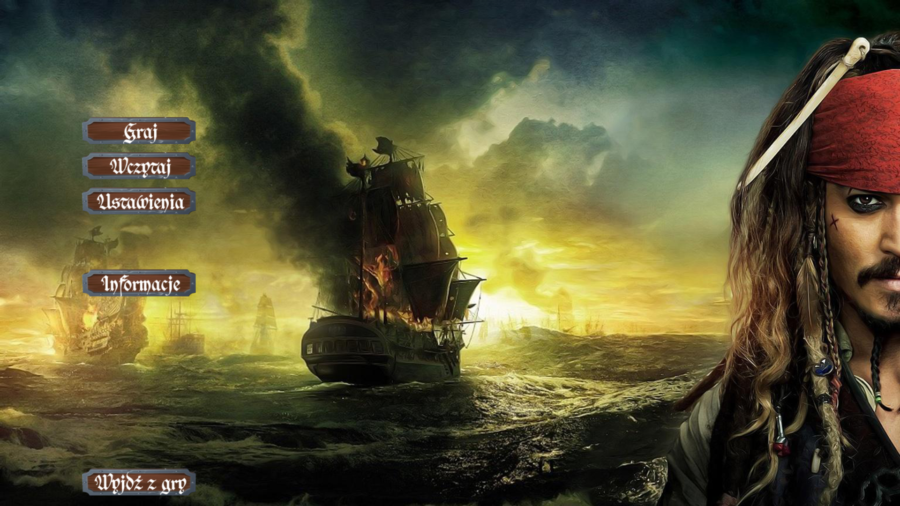

# Gra w Statki (Battleship) - Pygame
 **[PL]**  
 Gra w statki w motywie "Piraci z Karaibów".  
 Możliwość wyboru poziomu trudności komputera.  
 Projekt napisany na potrzeby studiów PANS w Ciechanowie. (Rok II, Semestr Zimowy)    
 
 Do uruchomienia wymagany jest :  
 - Python (3.11)  
 - PyGame     
 
 GRA WYKORZYSTUJE ZDJĘCIA Z FILMÓW "PIRACI Z KARAIBÓW".   
 GRA NIE JEST WYKORZYSTYWANA KOMERCYJNIE Z TYMI GRAFIKAMI.  
 
 ### Licencja:
 Dostępna w pliku License.txt w repozytorium.  
 Należy zapoznać się z treścią.   

 _______

 **[ENG]**  
 Battleship game with a "Pirates of the Caribbean" theme.  
 The game allows for selecting the computer's difficulty level.   
 This project was developed for academic purposes at PANS in Ciechanow. (Year II, Winter Semester)    
 
 Requirements for running the program include:  
 - Python (3.11)  
 - PyGame  
 
 THE GAME USES IMAGES FROM THE "PIRATES OF THE CARIBBEAN" MOVIES.  
 THE GAME IS NOT USED COMMERCIALLY WITH THESE GRAPHICS.  
 
 ### License:
 Available in the License.txt file in the repository.  
 Please familiarize yourself with its contents.  